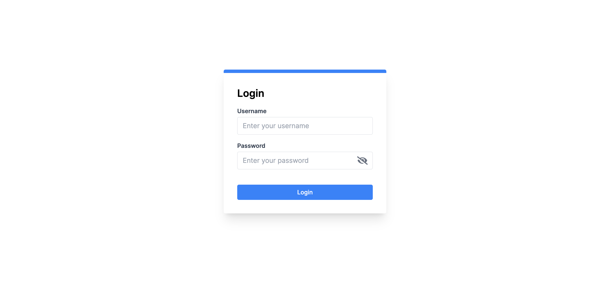
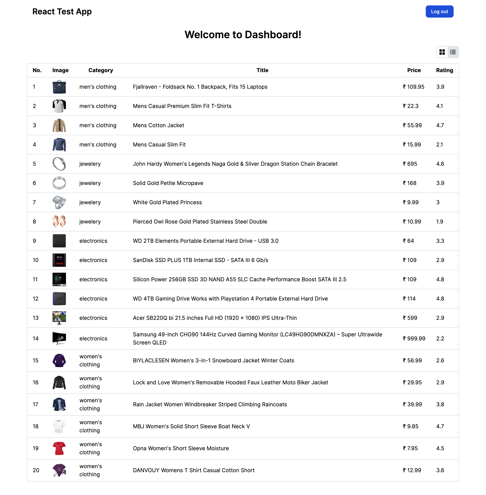

This is a demo project for the Freelancer code challenge.

## Getting Started

1. Install your dependencies:

```
 npm install
```

2. Run Test cases

```bash
npm run test
```

3. Run the development server:

```bash
npm run dev
```

## Login Details

```
Username : mor_2314
Password : 83r5^_
```

Open [http://localhost:3000](http://localhost:3000) with your browser to see the result.

You can start editing the page by modifying `app/pages/index.tsx`. 

### General information 
- Everything is separate and kind of in its hierarchy.
- This folder structure is very effective when having complex projects and a large team of developers.
- Code has very less comments that's intentional because a good code should be self-explanatory without explicit comments. 
- To make this more realistic we have used fakestoreapi.com for login and fetching data.

### Tests 
- We have written tests using Jest and can be found under src/__tests__ folder

### Screenshot

1. Login 


2. Dashboard - Grid View


3. Dashboard - List View



